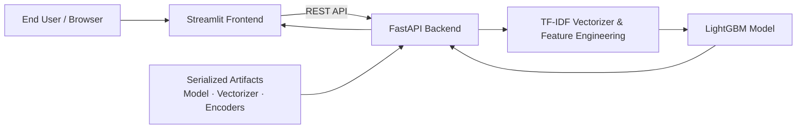

# Amazon Price Prediction: Full-Stack ML Edition 📦💰


## 📖 Introduction
Pricing products in a massive e-commerce ecosystem like Amazon is a high-stakes challenge. This project provides an end-to-end solution for predicting product list prices. What began as a research experiment in a Jupyter Notebook has evolved into a production-ready web application.

## 🎯 Project Scope
The application leverages Natural Language Processing (NLP) and Gradient Boosting to analyze product descriptions, identify brand prestige, and process physical unit measurements. It is engineered to handle 150,000+ listings while providing real-time, low-latency price estimates through a modern web interface.

## 🏗️ System Architecture
The project utilizes a decoupled **Client-Server Architecture** to separate the user interface from the heavy machine learning computations.

### 🔧 High-Level Architecture Diagram


### 🧠 Component Breakdown
1. **Machine Learning Engine:** A specialized LightGBM Regressor trained on 20,000 TF-IDF features and extracted brand metadata.
2. **Backend (FastAPI):** An asynchronous Python API that manages model inference, input validation, feature orchestration, and acts as the system control plane.
3. **Frontend (Streamlit):** A reactive dashboard providing an intuitive UI for users to submit product data and visualize AI-generated insights.

## 🛠️ Tech Stack
- **Frontend:** Streamlit (Data-centric UI framework)
- **Backend:** FastAPI (High-performance web API)
- **ML Core:** LightGBM, Scikit-Learn
- **Vectorization:** TF-IDF (Term Frequency-Inverse Document Frequency)
- **Data Ops:** Pandas, NumPy, Scipy Sparse Matrices
- **Environment:** Virtualenv, Uvicorn

## 🤖 Model Evolution & Benchmarks
I iterated through multiple modeling strategies to optimize for accuracy, measured via **SMAPE (Symmetric Mean Absolute Percentage Error)**.

| Model Phase | Methodology | Key Features | SMAPE (Lower is Better) |
|-----------|-------------|--------------|-------------------------|
| 01 | Baseline | TF-IDF (20k) + Basic Numerics | ~52.1 |
| 02 | LSA (SVD) | 300 Latent Topics | 53.8 |
| 03 | Brand-Integrated | LSA + Regex Brand Tags | 51.4 |
| 04 | **Champion** | **TF-IDF + Brand + Numerics** | **50.38 🏆** |
| 05 | Tuned | Higher Complexity Model | 51.04 |

> **Key Insight:** Sharp lexical signals such as specific quantities and product qualifiers captured by TF-IDF outperformed broader latent representations from SVD.

## 📂 Project Structure
```text
├── data/
│   ├── raw/             # Original train.csv and test.csv
│   └── processed/       # Cleaned Parquet files
├── models/              # Serialized artifacts (Model, TF-IDF, Encoders)
├── notebooks/           # Research Phase experiments
├── src/
│   ├── main.py          # FastAPI Backend service
│   ├── app.py           # Streamlit Frontend application
│   └── predict.py       # Standalone CLI predictor
├── requirements.txt     # Dependency list
└── README.md
```

## ⚙️ Installation & Setup

### 1. Clone and Install
```bash
# Clone the repository
git clone https://github.com/Your-Username/Amazon_Price_Prediction.git
cd Amazon_Price_Prediction

# Create and activate virtual environment
python -m venv venv
# On Windows: venv\Scripts\activate
# On Mac/Linux: source venv/bin/activate

# Install dependencies
pip install -r requirements.txt
```

### 2. Launch the Application
Open two terminal windows.

**Terminal 1: Start the API (Backend)**
```bash
uvicorn src.main:app --reload
```
API documentation is available at http://127.0.0.1:8000/docs.

**Terminal 2: Start the UI (Frontend)**
```bash
streamlit run src/app.py
```

## 🔍 How to Use the Predictor
1. Navigate to the Streamlit dashboard (http://localhost:8501).
2. Enter a detailed product description.
3. Adjust pack size and measurement fields.
4. Click **Estimate Price** to trigger inference.
5. Review the predicted price and detected brand.

## 🚀 Future Scope
- **Deployment:** Dockerized deployment on AWS or GCP.
- **Computer Vision:** Image-based feature extraction using CNNs.
- **Retraining Loop:** Feedback-driven continuous learning pipeline.

---
Developed by **Yash Gupta** | yash8740gupta@gmail.com | www.linkedin.com/in/yash-gupta82/
